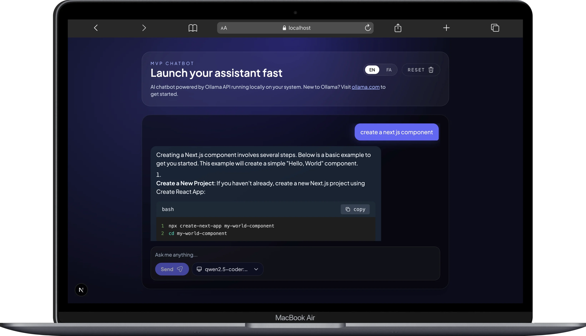

# AI ChatBot

A modern, feature-rich chatbot application built with Next.js 16, designed to work with local OpenAI-compatible servers like Ollama. Features real-time streaming responses, persistent chat history, multi-language support, and a beautiful, responsive UI.



## 🚀 Technology Stack

### Core Framework
- **Next.js 16** - React framework with App Router for server-side rendering and API routes
- **React 19** - Latest React with improved performance and concurrent features
- **TypeScript 5.7** - Type-safe development with latest TypeScript features

### State Management & Data Flow
- **Zustand 5.0** - Lightweight state management for chat messages, user input, and model selection
- **LocalStorage Persistence** - Custom storage layer for persisting chat history and preferences across sessions

### Styling & UI
- **Tailwind CSS 3.4** - Utility-first CSS framework with custom design system
- **Custom Theme** - Extended color palette (midnight shades), custom fonts, and glow effects
- **Responsive Design** - Mobile-first approach with adaptive layouts

### Markdown & Code Rendering
- **react-markdown 10.1** - Full markdown support for AI responses
- **react-syntax-highlighter 16.1** - Syntax highlighting for code blocks with multiple language support
- **@tailwindcss/typography** - Beautiful typography styles for markdown content

### Internationalization
- **Custom i18n System** - Built-in language switching (English/Persian)
- **RTL Support** - Right-to-left layout support for Persian language
- **IRANYekan Font** - Custom Persian font integration

### API Integration
- **OpenAI-Compatible API** - Works with Ollama, LM Studio, or any OpenAI-compatible endpoint
- **Streaming Support** - Real-time response streaming (architecture ready)
- **Model Selection** - Dynamic model switching with API endpoint discovery

## 🏗️ Architecture & Project Structure

### Feature-Based Architecture

The project follows a **feature-based modular architecture** for scalability and maintainability:

```
src/
├── app/                          # Next.js App Router
│   ├── api/
│   │   ├── chat/route.ts        # Chat completion endpoint
│   │   └── models/route.ts      # Model discovery endpoint
│   ├── layout.tsx               # Root layout with metadata
│   ├── page.tsx                 # Home page (renders ChatPage)
│   └── globals.css              # Global styles & font imports
│
├── core/                         # Core utilities & infrastructure
│   └── storage/
│       └── localStorage.ts      # Type-safe localStorage wrapper
│
└── features/                     # Feature modules
    ├── chat/                     # Chat feature module
    │   ├── components/
    │   │   ├── ChatPage.tsx     # Main chat container
    │   │   ├── ChatMessage.tsx  # Message bubble component
    │   │   ├── ChatInput.tsx    # Input field with send button
    │   │   ├── CodeBlock.tsx    # Syntax-highlighted code blocks
    │   │   ├── ModelSelector.tsx # Model dropdown selector
    │   │   ├── CompactModelSelector.tsx # Compact model UI
    │   │   ├── TypingIndicator.tsx # Loading animation
    │   │   └── WelcomeScreen.tsx # Empty state UI
    │   ├── hooks/
    │   │   └── useTypingAnimation.ts # Typing effect hook
    │   ├── store/
    │   │   └── useChatStore.ts  # Zustand store for chat state
    │   ├── types/
    │   │   └── chat.ts          # TypeScript types & interfaces
    │   └── assets/
    │       └── IranYekanFont/   # Persian font files
    │
    └── language/                 # Language/i18n feature module
        ├── components/
        │   └── LanguageSelector.tsx # Language switcher
        ├── store/
        │   └── useLanguageStore.ts # Language state management
        └── translations.ts       # Translation strings
```

### Design Patterns & Principles

#### 1. **Feature Module Pattern**
Each feature (chat, language) is self-contained with its own:
- Components (UI layer)
- Store (state management)
- Types (TypeScript definitions)
- Hooks (reusable logic)

#### 2. **State Management Architecture**
```typescript
// Zustand store with persistence
useChatStore:
  - messages: ChatMessage[]      // Chat history
  - input: string                // Current user input
  - isTyping: boolean            // Loading state
  - selectedModel: string        // Active AI model
  - sendMessage()                // Async message handler
  - clearChat()                  // Reset conversation
```

#### 3. **API Route Architecture**
```
Client → /api/chat → Ollama Server (localhost:11434)
         ↓
    POST /chat/completions
         ↓
    { messages, model, temperature }
         ↓
    Response → Client
```

#### 4. **Type Safety**
```typescript
// Strict typing throughout
ChatMessage {
  id: string
  role: "system" | "user" | "assistant"
  content: string
  createdAt: number
}
```

#### 5. **Component Composition**
```
ChatPage
├── LanguageSelector
├── ModelSelector
├── WelcomeScreen (conditional)
├── ChatMessage[] (mapped)
│   └── CodeBlock (conditional)
├── TypingIndicator (conditional)
└── ChatInput
```

## 🎨 Design System

### Color Palette
- **Midnight Theme** - Custom indigo-based color scale (50-950)
- **Gradient Backgrounds** - Subtle gradients for depth
- **Glow Effects** - Custom shadow utilities for interactive elements

### Typography
- **Display Font** - Space Grotesk (headings)
- **Body Font** - Plus Jakarta Sans (content)
- **Persian Font** - IRANYekanX (RTL support)

### Responsive Breakpoints
- Mobile: < 640px
- Tablet: 640px - 1024px
- Desktop: > 1024px

## 🔧 Key Features

### 1. **Persistent Chat History**
- Automatic localStorage sync
- Survives page refreshes
- Per-model conversation tracking

### 2. **Model Management**
- Dynamic model discovery via `/api/models`
- Real-time model switching
- Model-specific configurations

### 3. **Rich Message Rendering**
- Full markdown support
- Syntax-highlighted code blocks
- Inline code formatting
- Lists, tables, and blockquotes

### 4. **Multi-Language Support**
- English/Persian toggle
- RTL layout switching
- Localized UI strings

### 5. **Developer Experience**
- TypeScript strict mode
- ESLint configuration
- Hot module replacement
- Type-safe API routes

## 🚀 Getting Started

### Prerequisites

1. **Install Ollama**
   - Download from [ollama.com](https://ollama.com/)
   - Pull a model: `ollama pull llama3.2`

2. **Install Dependencies**
   ```bash
   npm install
   ```

3. **Configure Environment**
   ```bash
   cp .env.example .env.local
   ```
   
   Edit `.env.local`:
   ```env
   OPENAI_BASE_URL=http://localhost:11434/v1
   OPENAI_MODEL=llama3.2
   ```

4. **Run Development Server**
   ```bash
   npm run dev
   ```
   
   Open [http://localhost:3000](http://localhost:3000)

## 📦 Build & Deployment

```bash
# Production build
npm run build

# Start production server
npm start

# Lint code
npm run lint
```

## 🔌 API Compatibility

Works with any OpenAI-compatible API:
- **Ollama** (default)
- **LM Studio**
- **LocalAI**
- **OpenAI** (with API key)
- **Custom endpoints**

## 📝 License

MIT License - feel free to use this project for learning or production.

---

Built with ❤️ using Next.js, TypeScript, and Tailwind CSS
